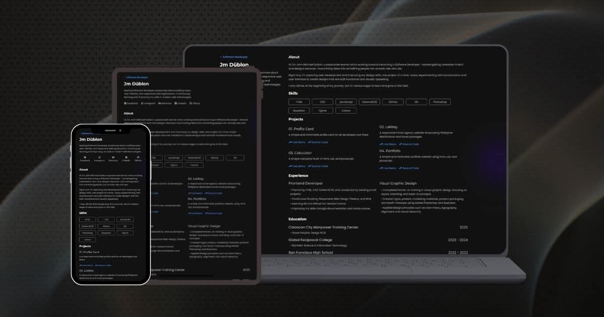

# Portfoliox

A personal portfolio website showcasing my skills, experience, projects, certificates and a background as a software developer and a graphic designer.

### Portfolio Preview



### Features

- Responsive Web Design
- Modern and Clean UI
- Mobile Friendly Navigation
- About Me Section
- Skills Section
- Experience Section
- Project Section
- Contact Section

### Technology


### Project Structure

```
Portfoliox/
├── Assets/
│   ├── Audio/
│   ├── Certificates/
│   ├── Images/
│   └── Layout/
├── .gitignore
├── index.html
├── license
├── main.js
├── NOTE.txt
├── README.md
├── style.css
```

### Clone this Repository

```
git clone https://github.com/Dublonx/Portfoliox.git